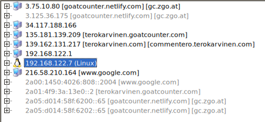

# 👃 H1 - Sniff

This is Homework 1 from the course Network Attacks and Reconnaissance  
🔗 https://terokarvinen.com/verkkoon-tunkeutuminen-ja-tiedustelu/

## 📑 Contents
- [📘 X) Read and summarize](#x)
- [💻 A) Install Debian or Kali Linux](#a)
- [🔌 B) Disable and restore internet connection](#b)
- [🧪 C) Capture traffic with Wireshark](#c)
- [🌐 D) Demonstrate TCP/IP model layers](#d)
- [📁 E) Overview of surfing-secure.pcap](#e)
- [🌍 F) What browser is the user using?](#f)
- [📡 G) What brand is the user's network card?](#g)
- [🖥️ H) What web server did the user visit?](#h)
- [🧠 I) Self-traffic capture and deep analysis](#i)
- [🛠️ Tools and Hardware Used](#tools)
- [📚 Resources](#resources)

---

<a name="x"></a>
## 📘 X) Read and summarize

### **Karvinen 2025:** [Wireshark - Getting Started](https://terokarvinen.com/wireshark-getting-started/)

- Article about Getting started with Wireshark 
- How to install wireshark
- How to sniff the network traffic
- Identifying packets
- Saving traffic into pcap file
- Viewing traffic, statistics and filtering traffic

---

### **Karvinen 2025:** [Network Interface Names on Linux](https://terokarvinen.com/network-interface-linux/)


- Article about network cards / interface names 

- en* wired ethernet
- wl* wireless
- lo* loopback

-  prefix followed by card id, for example **enp1s0** 
**en**= wired card
**p1**= pci bus 1
**s0**= slot 1 

- to check interfaces, `ip a` or `ip route`
---

<a name="a"></a>
## 💻 A) Install Debian or Kali Linux

>Install Debian or Kali Linux in a virtual machine.  
*No need to report this unless you face problems. If so, provide a detailed and reproducible report.*

Installed previously without issues.

---

<a name="b"></a>
## 🔌 B) Disable and restore internet connection

>Prove that you can disable and then restore your VM’s internet connection.  
Show tests like `ping` or browser access before and after.

Disabling internet connection by closing the interface with:

```
sudo ifconfig eth0 down
```


`ping 8.8.8.8` to test access.


Internet access is disabled, now lets bring it back up with:

`sudo ifconfig eth0 up`


And testing the ping works.


Alternatively, since we are on a vm, we can also "unplug" the connection via virtualbox settings

**Devices -> Network -> Network settings**

Under advanced adapter settings we have the Cable Connected checkbox


---

<a name="c"></a>
## 🧪 C) Capture traffic with Wireshark

>Install Wireshark and capture your own traffic (only your own).  
A virtual machine is recommended for this.

We have wireshark already installed.


Opening wireshark and choosing eth0 and start capturing

for a simple example i only use

`curl http://google.com`

and then stop recording.


---

<a name="d"></a>
## 🌐 D) Demonstrate TCP/IP model layers

>Pick one captured packet and demonstrate the 4 layers of the TCP/IP model.  
Use boxes or highlights on a screenshot if needed.

Choosing the first HTTP frame in the capture. And listing TCP-IP layers from top to bottom.

**Application Layer** data can be shown by pressing the hypertext transfer protocol, in this example it shows http get request to google.com with curl.


**Transport Layer** is the next part from bottom of the packet, also shown as transmission control protocol on the left bottom pane.


**Internet Layer** has routing addresses, source and destination ip. 


**Network Access Layer** 

From the right bottom pane we can see that its the first part of the packet, contains MAC addresses.


---

<a name="e"></a>
## 📁 E) Overview of surfing-secure.pcap

>Open `surfing-secure.pcap` and provide a general overview:

>- How many devices?

12 "hosts", with 192.168.122.7 being the client/capture point




>- Notable protocols?

- IP
  - UDP
    - DNS
    - QUIC
  - TCP
    - TCP
    - TLSv1.2
    - TLSv1.3
- ARP

ovewview from **Statistics -> Protocal Hierarchy**


>- How many packets?

283

>- Duration and size of capture?

7,536 seconds
122,445 KB

**Statistics -> Capture Properties** 


---

<a name="f"></a>
## 🌍 F) What browser is the user using?

>"Analyze `surfing-secure.pcap` and identify the browser from user-agent strings or headers."

user-agent not found. 
Packet 105, Client Hello has browser JA* fingerprints, they are used to identify devices/apps.

JA3 a195b9c006fcb23ab9a2343b0871e362 fingerprinted online as mozilla firefox 116+

Checking ja4 fingerprint from ja4db.com
ja4 fingerprint identified as **Firefox**


https://ja4db.com/application/Firefox%20121.0%20

ja3 db was offline but found some other sources mentioning the same ja3 id

Sources: https://tria.ge/240618-qehefsygkn/behavioral6/analog?flow=199

https://github.com/xnih/satori/blob/master/fingerprints/ssl.xml

---

<a name="g"></a>
## 📡 G) What brand is the user's network card?

>Identify the NIC manufacturer from MAC addresses (OUI) in `surfing-secure.pcap`.


Users(192.168.122.7) mac address can be found in the frames:


Client has a common MAC address for virtual NIC starting 52:54:00

**52:54:00:2f:e1:e5**

This does not usually come up in OUI lookups.

---

<a name="h"></a>
## 🖥️ H) What web server did the user visit?

>From `surfing-secure.pcap`, determine which web server the user accessed.  
The connection is TLS encrypted, so only metadata is visible.

terokarvinen.com


packets also include google.com but maybe it was already open when capture was started since there are not many packets.

---

<a name="i"></a>
## 🧠 I) Self-traffic capture and deep analysis

>Capture a small amount of your own traffic and analyze it thoroughly.  
Explain everything that happens, even seemingly basic things.

I wanted to see what ssh traffic looks like and if i can detect anything useful from it, so started capturing, to test the capture i first ran curl app.sisuctf.com

### http / https tests

this was actually a good test since i found out our ict-project website http redirect to https did not work after some updates we made this week.


In between TCP packets we can see DNS queries to my router

trying again to curl, but this time with https

```
curl https://app.sisuctf.com
```

it now works, and captures TLS traffic with the website


### ssh traffic

Initiating SSH from terminal, after access i type whoami, and then exit. lets see what wireshark captured:


At a glance, i can see there are LOTS of packets only from a short connection, most of it is enncrypted, but we can see some identifiers.

When following full stream, we can see the stream starts with SSH banners of both participants, Debian, Ubuntu and ssh versions:


After this we get key exhange inits, and diffie hellman key exhchange


In short, its the method used to exchange keys

More about https://en.wikipedia.org/wiki/Diffie%E2%80%93Hellman_key_exchange

https://en.wikipedia.org/wiki/Key_exchange

I tried to find a part that would reveal something about the connection, for example if login was used with certificate or password, but my packets did not include the data.

However i can see that between the encryption and the next packet, there is 12 seconds delay, this would strongly indicate that password login was used.


after the connection is open, packets are going nonstop, with both encrypted sshv2 packets and keep-alive ACK packets

The whole connection lasted only 8 seconds after login, but that 8 seconds contained around 600 packets

## http redirect fixed

After fixing the http redirect and re-capturing the traffic from the command `curl http://app.sisuctf.com`

i can now see the packets that should come from this conversation:


first 3 packets of the stream are 3-way tcp handshake


*Source: https://www.sciencedirect.com/topics/computer-science/three-way-handshake*

4th packet is the get request


followed by an ack "ok"

and then the response


---

<a name="tools"></a>
## 🛠️ Tools and Hardware Used

- **Virtualization:** VirtualBox
- **Operating System:** Kali Linux
- **Network Analysis:** Wireshark, NetworkMiner, curl
- **Hardware:** AMD Ryzen 9 5900X, NVIDIA RTX 3080, 32GB RAM  

---

<a name="resources"></a>
## 📚 Resources

- https://ja4db.com/application/Firefox%20121.0%20


- https://en.wikipedia.org/wiki/Diffie%E2%80%93Hellman_key_exchange

- https://en.wikipedia.org/wiki/Key_exchange

- https://www.sciencedirect.com/topics/computer-science/three-way-handshake

- https://terokarvinen.com/verkkoon-tunkeutuminen-ja-tiedustelu/  
  *(Karvinen 2025)*  
- https://terokarvinen.com/wireshark-getting-started/  
  *(Karvinen 2025)*  
- https://terokarvinen.com/network-interface-linux/  
  *(Karvinen 2025)*  
