# 🟣 H2 - Favourite color: violet

This is Homework 2 from the course Network Attacks and Reconnaissance  
🔗 https://terokarvinen.com/verkkoon-tunkeutuminen-ja-tiedustelu/

In this assignment, we explore how network scanning tools like Nmap can leave identifiable traces, and how attackers can attempt to evade detection by modifying their behavior or tools. We'll analyze logs and network captures to identify scan fingerprints.

---

## 📑 Contents
- [📘 X) Background Questions](#x)
- [🧾 A) Apache log analysis](#a)
- [📡 B) Nmap scan](#b)
- [🔍 C) Nmap scripts](#c)
- [📁 D) Nmap trace in logs](#d)
- [🧪 E) Wireshark capture](#e)
- [📈 F) Ngrep match](#f)
- [🎭 G) Change User-Agent](#g)
- [🔧 H) Re-scan with altered agent](#h)
- [🛠️ I) Hide Nmap traces](#i)
- [🕵️‍♂️ J) Optional: Evade with modified script](#j)
- [🛠️ Tools and Hardware Used](#tools)
- [📚 Resources](#resources)

---

## 📘 X) Read and answer briefly

> **Explain the concept of the Pyramid of Pain** in 1–2 sentences. (Bianco 2013: *Pyramid of Pain*. Focus especially on the visual diagram.)  

The pyramid of pain visualizes how big of a pain for the attacker when you detect and deny them. hashes being the lowest level, then IP addresses, domain names, network/host artifacts, tools,  and TTPs big pain. If the attacker gets caught at the top, they have to think over the whole approach.

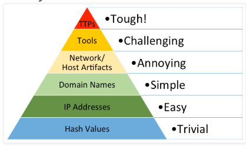

> **Explain the concept of the Diamond Model** in 1–2 sentences. (Caltagirone et al 2013: *Diamond Model*. The author introduces it formally; you may search for simpler explanations or go directly to the diagram.)

Diamond model is used to analyze cyber threats. Who attacked? How? Who/What was the target? What infrastructure was used? 

Using the models different sides to tie together the full picture of the attack.

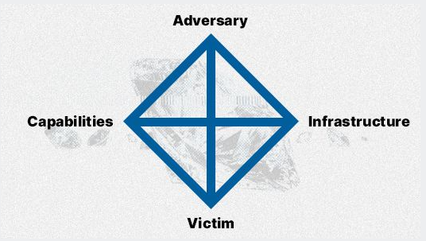

---

## 🧾 A) Apache log

> Install the Apache web server on your local virtual machine.  
> Visit your own server over unencrypted HTTP: `http://localhost`.  
> Find the log entry that corresponds to your visit.  
> Analyze a single log line — explain what each part of the line means.  
> *(If you’re unfamiliar with Apache, you can simply install it and use the default web page — no need to build a custom site.)*

`sudo apt install apache2`

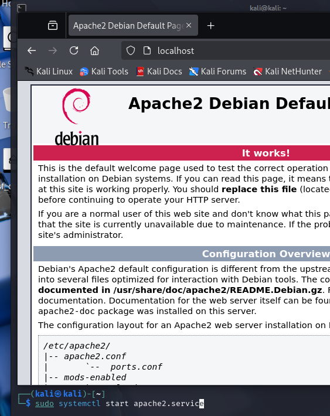

apache2 is now up on localhost, checking access log

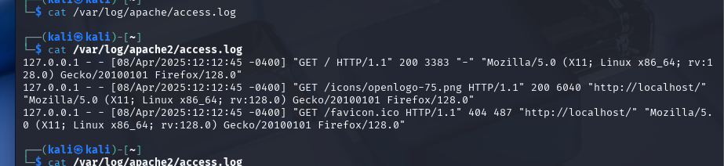

First row,

Me **127.0.0.1** localhost 
on **timestamp** 12:12:45 8.4.2025
sending a **GET HTTP** request, 
status code is **200** "OK"
User-agent: Im using **Mozilla firefox 128**, on a **64bit linux**

---

## 📡 B) Nmap scan

> Use `nmap -A` to scan your own web server using the `localhost` address.  
> Focus only on the HTTP port (80/tcp is enough).  
> Explain what the results mean — what did Nmap discover?

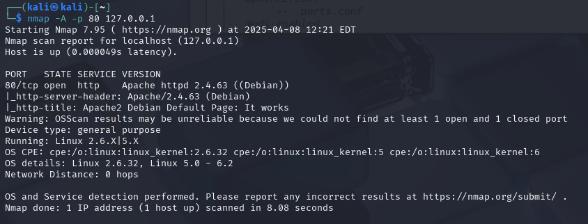

using `nmap -A -p 80 127.0.0.1`

PORT   STATE SERVICE VERSION
80/tcp open  http    Apache httpd 2.4.63 ((Debian)) **port 80 open, service is http**
|_http-server-header: Apache/2.4.63 (Debian) **version and name of webserver, Debian based os**
|_http-title: Apache2 Debian Default Page: It works **page works**
Warning: OSScan results may be unreliable because we could not find at least 1 open and 1 closed port
Device type: general purpose **general purpose os?**
Running: Linux 2.6.X|5.X **possible kernel versions**
OS CPE: cpe:/o:linux:linux_kernel:2.6.32 cpe:/o:linux:linux_kernel:5 cpe:/o:linux:linux_kernel:6 **possible kernel versions**
OS details: Linux 2.6.32, Linux 5.0 - 6.2 **possible kernel versions**
Network Distance: 0 hops **at 0 hops we are at the server without routing**

---

## 🔍 C) Scripts

> What scripts were automatically run by Nmap when you used the `-A` parameter?  
> (They appear under the open ports in the output — for example, lines starting with `http-...`.)

using the debug param -d (`nmap -A localhost -d`) outputs the files used during scan

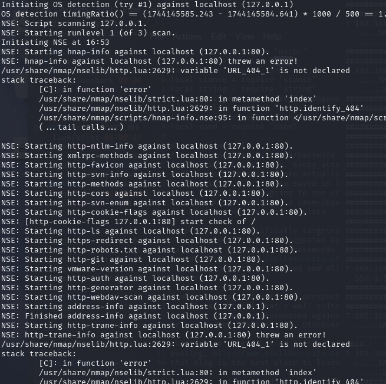

-A = aggressive scan, uses following param

OS detection (-O)
Version detection (-sV)
Script scanning (-sC)
Traceroute (--traceroute)

**-O this added OS related stuff**
*Warning: OSScan results may be unreliable because we could not find at least 1 open and 1 closed port
Device type: general purpose
Running: Linux 2.6.X|5.X
OS CPE: cpe:/o:linux:linux_kernel:2.6.32 cpe:/o:linux:linux_kernel:5 cpe:/o:linux:linux_kernel:6
OS details: Linux 2.6.32, Linux 5.0 - 6.2
Network Distance: 0 hops*

**-sV added the apache version, without it. the scan would look like this:**

**-sC added default scripts**

when used **-A/-sC** and http service is found, the http scripts from this scripts list are used https://svn.nmap.org/nmap/scripts/

`nmap --script-help default` lists a long list of the scripts used

**in our results:**

*|_http-server-header: Apache/2.4.63 (Debian)
|_http-title: Apache2 Debian Default Page: It works*

**http-server-header** grabs Server: header part
**http-title grabs** `<title>` tag

Our previous scan was missing the traceroute part at the bottom of the output, but heres an example what it looks like when scanning another http server:

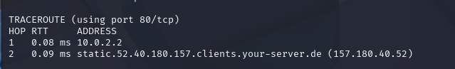

(source: https://www.codecademy.com/resources/docs/cybersecurity/nmap/aggressive-scan)

(source: https://explainshell.com/explain?cmd=nmap+-sC+-sV+-v+)

---

## 📁 D) Scan traces in logs

> Search the Apache log files for traces left by the port scan — especially those from NSE (Nmap Scripting Engine) scripts.  
> Do you find the word **“nmap”**, either lowercase or uppercase?  
> Explain any matches.  
> How would you detect port scans in a large log where you can't read every line manually?

**Busted** for sure, has nmap written all over it:

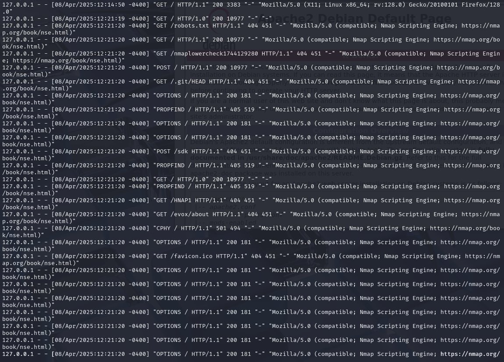

all the scans made at 12:21:20 from one scan

the line starting with grabbing robots.txt:

**http-robots.txt.nse** ("GET /robots.txt HTTP/1.1")
**http-git.nse** ("GET /.git/HEAD HTTP/1.1")
**http-favicon.nse** ("GET /favicon.ico HTTP/1.1")
**http-enum.nse** ("GET /evox/about HTTP/1.1")**

and several others too.

To manually scan for nmap in the logs with grep pipe 

`cat /var/log/apache2/access.log | grep nmap`

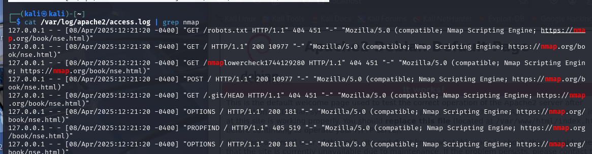

Preventing nmap could also be automated, for example with a custom fail2ban apache filter

---

## 🧪 E) Wireshark capture

> Capture network traffic with **Wireshark** while scanning using Nmap.  
> Note that `localhost` traffic goes through the **Loopback adapter (`lo`)**.  
> Save the capture as a `.pcap` file.  
> Search for the word **“nmap”** in the traffic.  
> Comment on any relevant hits.  
> *(You don’t need to analyze every field of every packet — a general overview is enough.)*

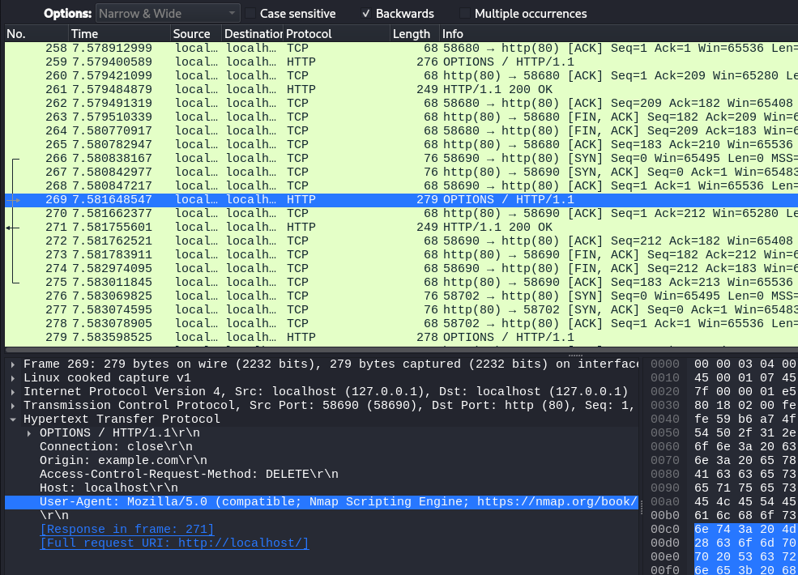

nmap string can be found in many packets 

Heres the packet that tries to grab robots.txt

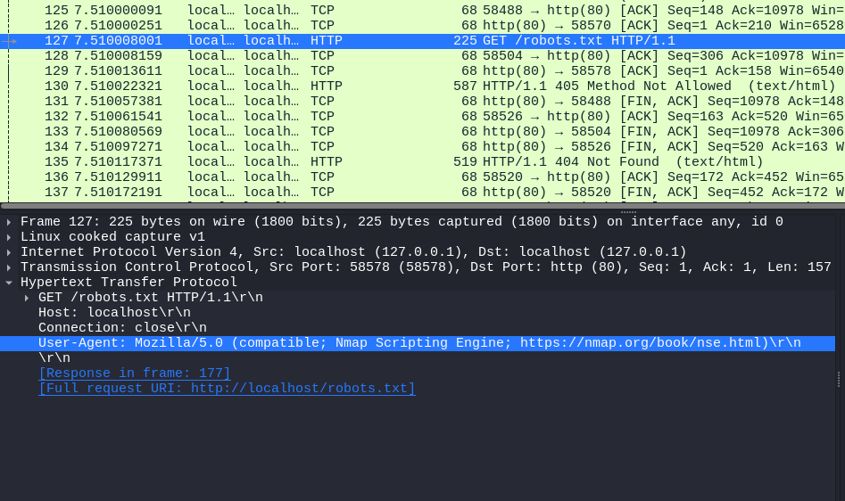

when we follow the http stream we can see that it wasnt found

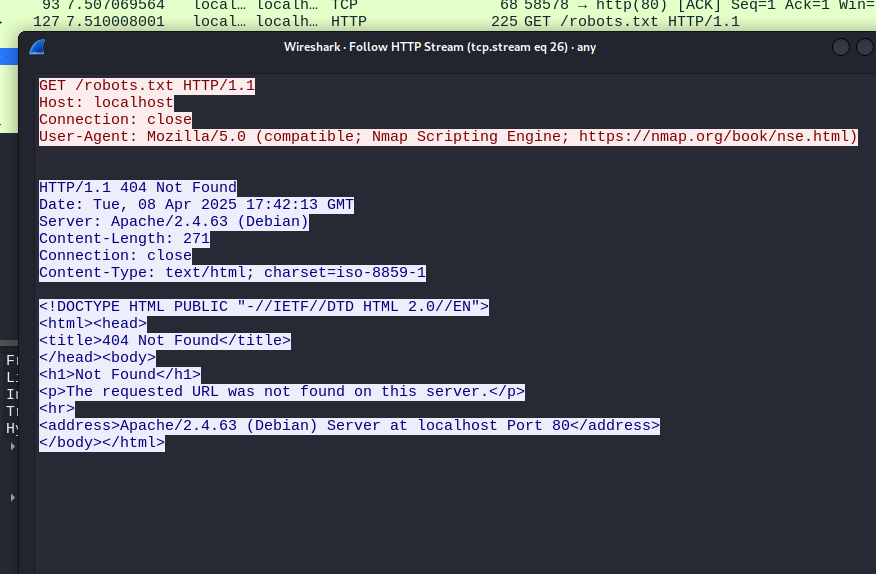

---

## 📈 F) Ngrep match

> Capture the port scan traffic using the `ngrep` command.  
> Show the lines where the word **“nmap”** appears.

to netgrep capture loopback:

`sudo ngrep -d lo`

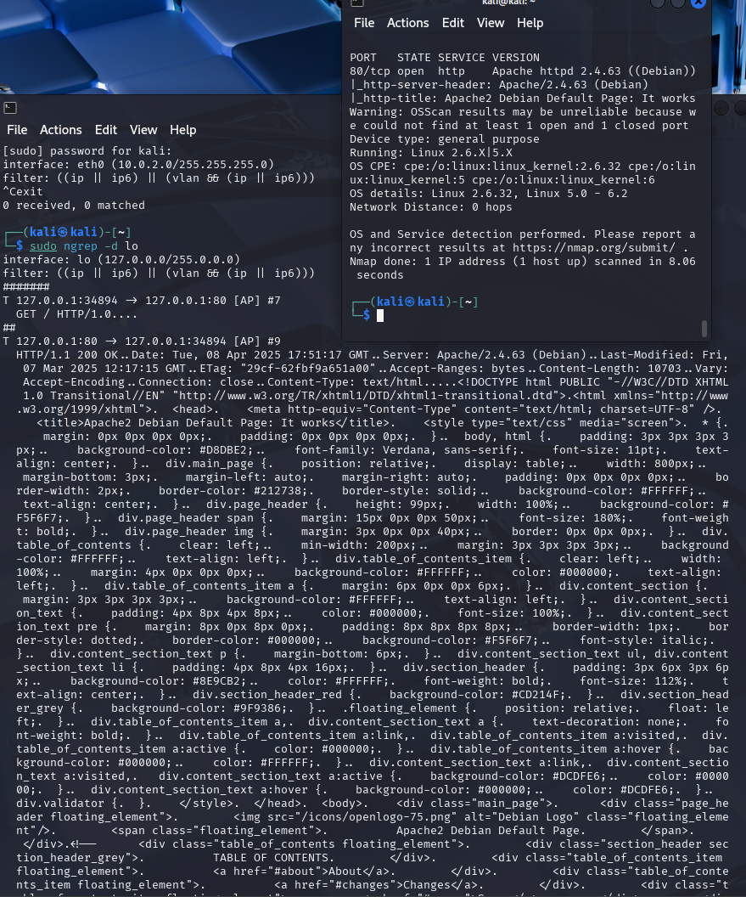

to find nmap lines from ngrep:

`sudo ngrep -d lo 'nmap'`

the output is much cleaner:

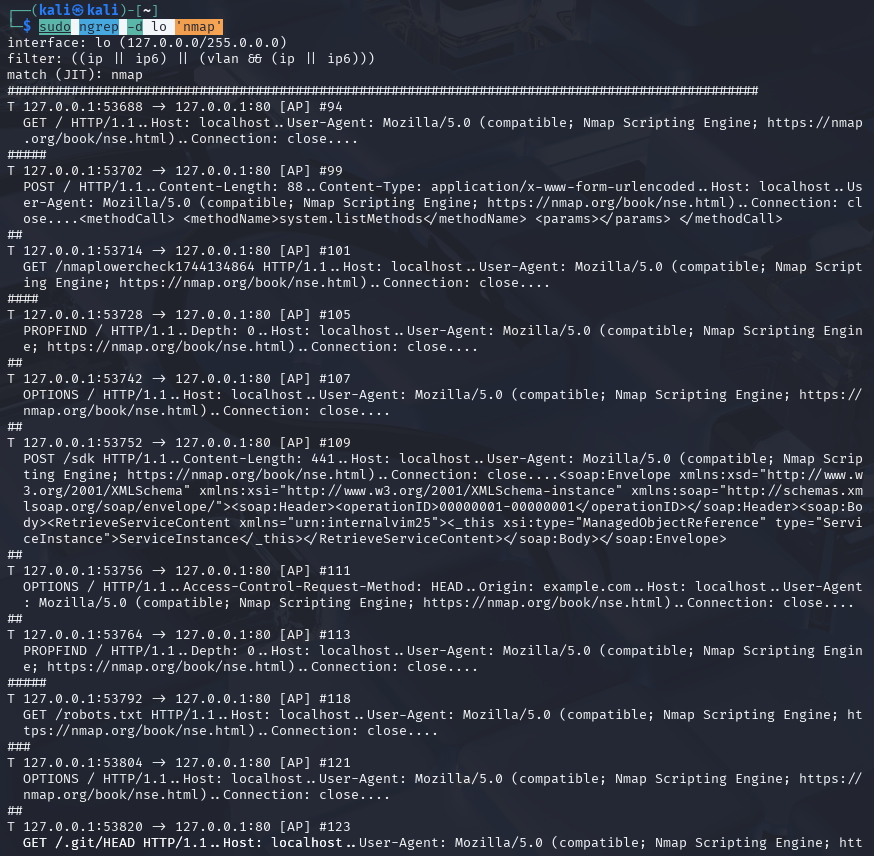

---

## 🎭 G) Modify User-Agent

> Change Nmap’s User-Agent string so that it mimics a regular web browser.  
> (Instead of sending something like "Nmap Scripting Engine", it should send a realistic browser header.)

inserting custom agent into the scan to appear as win10 user with chrome

`nmap -A -p 80 --script-args http.useragent="Mozilla/5.0 (Windows NT 10.0; Win64; x64) AppleWebKit/537.36 (KHTML, like Gecko) Chrome/122.0.0.0 Safari/537.36" 127.0.0.1`

---

## 🔧 H) Re-scan with custom User-Agent

> Scan your web server again with the new User-Agent.  
> Examine both the Apache log and the captured network traffic.  
> What changed?  
> Does the word **"nmap"** still appear?

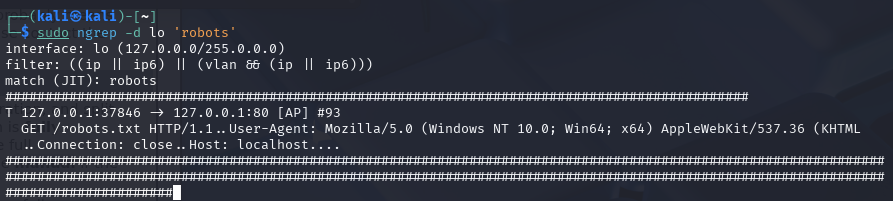

result, nmap is gone "mostly", its still visible in a script checking for nmaplowercheck

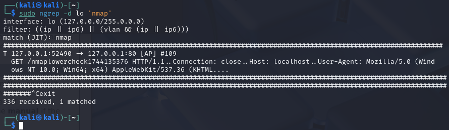

---

## 🛠️ I) Lower Check - Remove all traces

> Eliminate the last visible **“nmap”** string from script scanning.  
> Search for this string in `/usr/share/nmap` and replace it with something else.  
> Run the scan again.  
> Verify that the word **"nmap"** does not appear in **any form** (upper or lower case) in either the Apache logs or the network capture.  
> *(You can directly edit the Lua scripts under `/usr/share/nmap` using `sudoedit`.)*

`grep -r 'nmaplower' /usr/share/nmap`

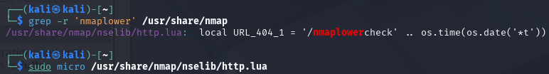

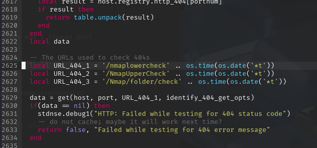

commenting this out with lua comment `--`

now the user-agent modified scan cant find any nmap strings

`sudo ngrep -d lo -i 'nmap'`

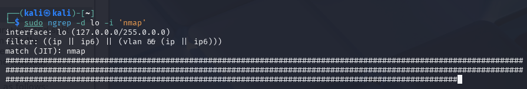

---

## 🕵️‍♂️ J) Optional, advanced: Invisible, Invincible

> Find another Nmap script that includes the word **"nmap"** in its network traffic.  
> Modify the Nmap source or script so that this string is no longer sent in the traffic.

looking for *.nse files containing nmap

`grep -rn '/usr/share/nmap/scripts/' -e 'nmap' --include='*.nse`

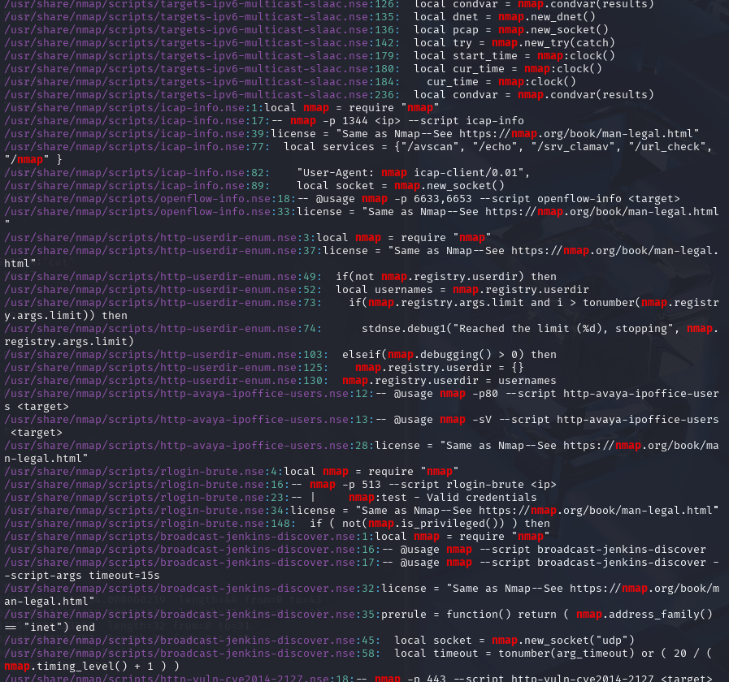

tried icap-info.nse by listening to 1344, but couldnt see nmap in the traffic.

Looked into a couple other files but found it hard to test.

Booted up metasploitable3 vm on the same network, and scanning with modified  user agent

`nmap -A --script-args http.useragent="Mozilla/5.0 (Windows NT 10.0; Win64; x64) AppleWebKit/537.36 (KHTML, like Gecko) Chrome/122.0.0.0 Safari/537.36" 192.168.56.106`

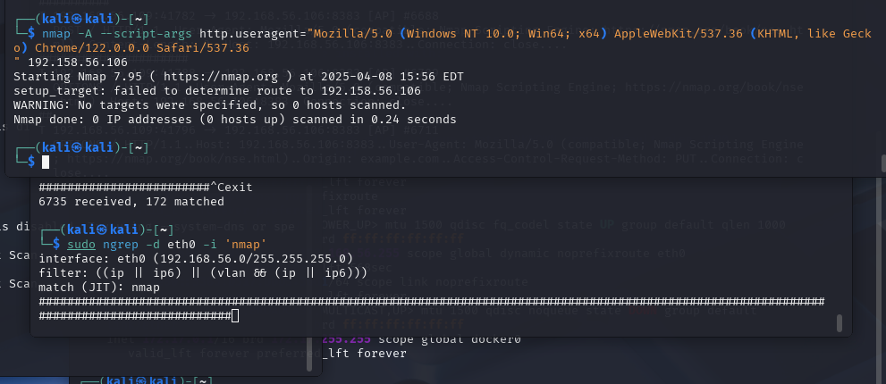

found some packets

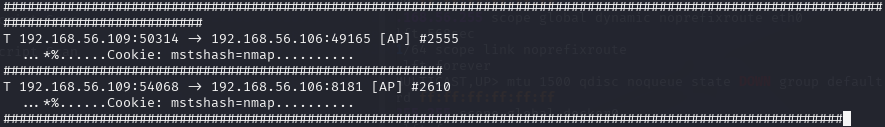

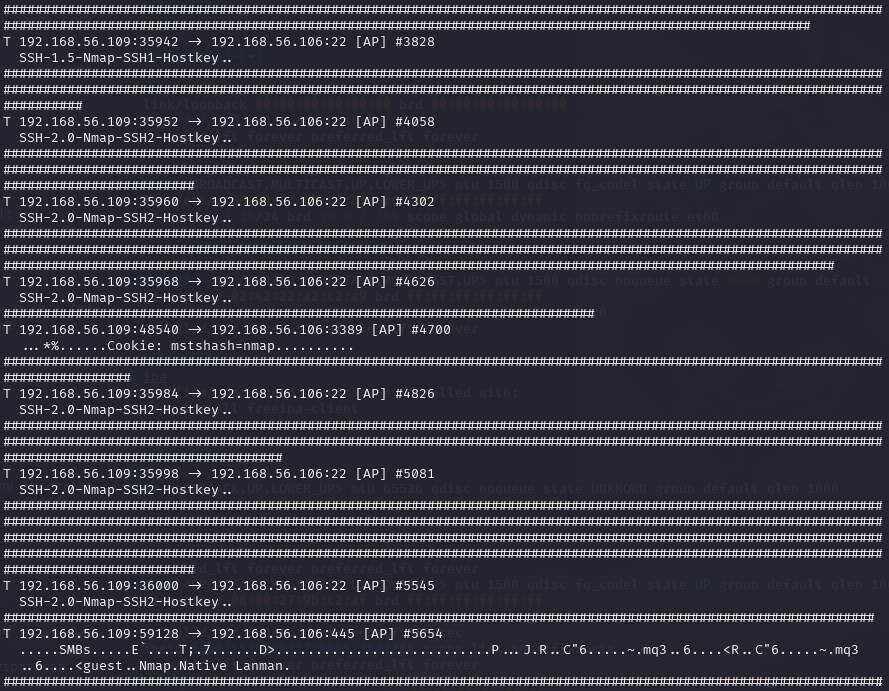

finding file with SSH2-NMAP

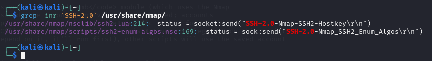

editing the part

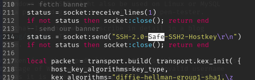

fixed.

next red flag was mstshash=nmap

`grep -inr 'mstshash=nmap' /usr/share/nmap/`

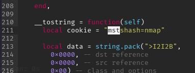

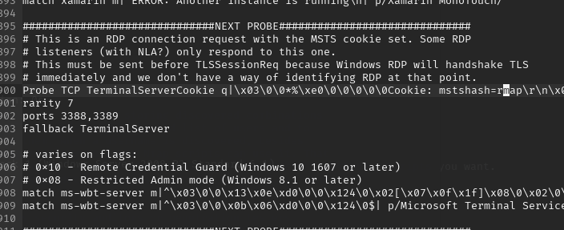

fixed.

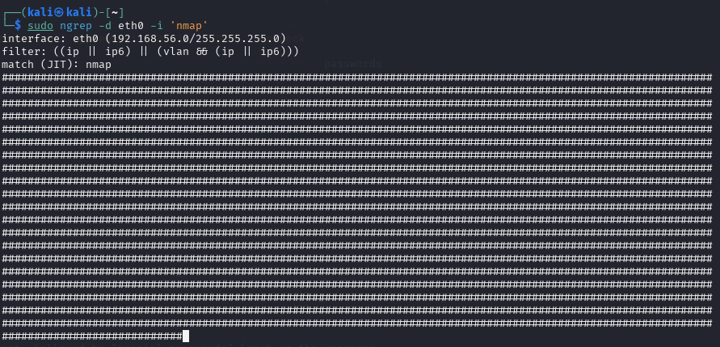

---

## 🛠️ Tools and Hardware Used

- **Virtualization:** VirtualBox  
- **Operating System:** Kali Linux / Debian  / Metasploitable3 Windows Server 2008
- **Scanning & Traffic Tools:** Nmap, Apache2, Wireshark, ngrep, grep 
- **Hardware:** AMD Ryzen 9 5900X, NVIDIA RTX 3080, 32GB RAM

---

## 📚 Resources

- https://www.oreilly.com/library/view/nmap-network-exploration/9781786467454/62ae3cc1-af7b-4046-89c1-a6eaa6c0b759.xhtml

- https://explainshell.com/explain?cmd=nmap+-sC+-sV+-v+

- https://www.loggly.com/use-cases/how-to-monitor-your-apache-logs/

- https://terokarvinen.com/verkkoon-tunkeutuminen-ja-tiedustelu/ *(Karvinen 2025)*  
- https://terokarvinen.com/wireshark-getting-started/ *(Karvinen 2025)*  
- https://terokarvinen.com/network-interface-linux/ *(Karvinen 2025)*  
