# 📡 H3 – Riding the Waves

This is Homework 3 from the course *Network Attacks and Reconnaissance*  
🔗 https://terokarvinen.com/verkkoon-tunkeutuminen-ja-tiedustelu/

In this assignment, we dive into Software Defined Radios (SDR), analyze real-world 433 MHz signals, and explore tools like `rtl_433` and URH. SDRs used to be science fiction – now they’re a budget hacker's tool starting from €25.

---

## 📑 Contents
- [📘 X) Read and summarize](#x)
- [🌍 A) Remote SDR via WebSDR](#a)
- [📻 B) Install rtl_433](#b)
- [🧠 C) Analyze with rtl_433](#c)
- [🔁 D) Convert and analyze complex16s format](#d)
- [🔧 E) Install URH - Ultimate Radio Hacker](#e)
- [🔍 F) Sample overview](#f)
- [🧮 G) Demodulate signal into raw bits](#g)
- [🧪 H) Try SDR++ (optional)](#h)
- [🔬 I) Try GNU Radio (optional)](#i)
- [🛠️ Tools and Hardware Used](#tools)
- [📚 Resources](#resources)

---

## 📘 X) Read and summarize

> Summarize the following articles or videos in a few bullet points.  
> No need to perform tests or deep analysis yet.

#### **Hubacek 2019**: *Universal Radio Hacker SDR Tutorial on 433 MHz radio plugs*  https://youtu.be/sbqMqb6FVMY?t=199 Watch from 3:19 to 7:40 (~4 minutes)

Using URH, how to find and set frequency to then record the transmission from an rf remote and saving it.

Then analyzing the saved transmission in the main application, how to change modulation and autodetect parameters

Demodulated signal view & filtering, bits to hex data.

#### **Cornelius 2022**: *Decode 433.92 MHz weather station data* https://www.onetransistor.eu/2022/01/decode-433mhz-ask-signal.html

A tutorial on decoding weather station data

- decoding signals with rtl_433
- how to capture transmission with URH
- creating project in URH
- measuring interval between transmissions
- demodulation similiarly than in previous cornelius video
- digital analysis, base functions

 

#### *(Optional)* **Lohner 2019**: *Decoding ASK/OOK_PPM Signals with URH and rtl_433* https://github.karllohner.com/SDR/Decoding/Example_2019-01-24/

- Article about decoding ASK signals with URH and rtl_433

- Loading complex files in URH, applying bandpass filter, zooming to signal

- Identifying symbol patterns

- Decoding in rtl_433 with commands like:

`rtl_433 -R 0 -r g001_433.92M_250k.complex16u -X n=SAMPLE1,m=OOK_PPM,s=1008,l=3024,r=3200,t=100`

 command breakdown: -R 1(disable builtin decoder) -X(custom decoder) modulation(OOK_PPM),gap lengths(s=1008,l=3024), reset time(r=3200), tolerance(t=100 )

---

## 🌍 A) Remote SDR via WebSDR

> Use a WebSDR station far from your location (≥400 km or in another country).  
> Capture and describe a public broadcast (e.g. FM radio).  
> Note the frequency, wavelength, and modulation type. Include a screenshot.

Browsing through lots of different signals from different wbsdr sites, but end up choosing a location for english language from websdr.org map view.

I chose 79 in picture

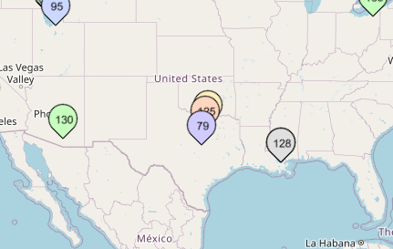

steps:

zooming slightly in on the waterfall view

choosing **40M band**

looking for high quality signals.

I see a strong waterfall at **5890kHz**, pressing it.

cant hear anything, i press the button chrome start audio.

selecting **AM**, and i can hear audio:

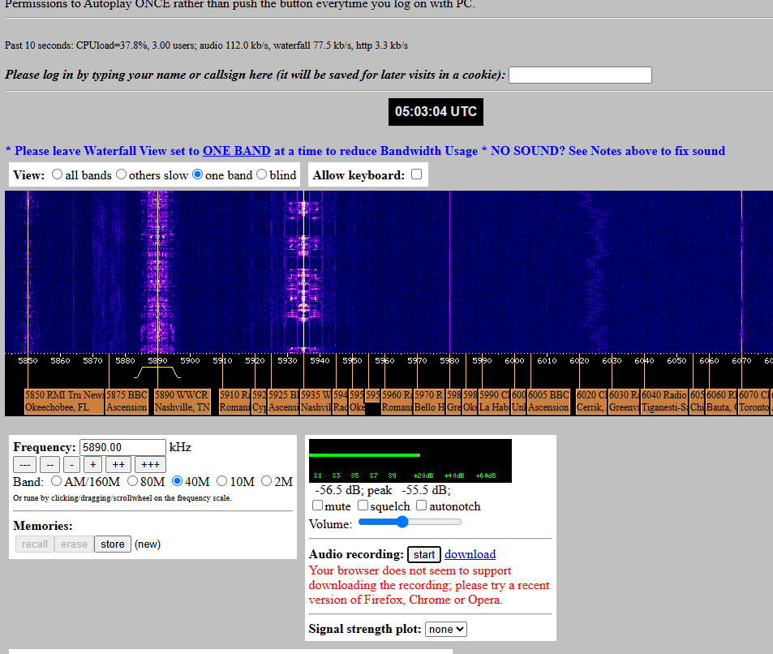

Started listening on 5890 WWCR Nashville TN

**AM 5890.00 kHz**

it sounds like its a live feed from a church ceremony, it has clearly the speakers voice and audience noise.

Googling wwcr, its World Wide Christian Radio. After the event the broadcast stops.

---

## 📻 B) Install rtl_433

> Install `rtl_433` and ensure it runs correctly.  
> Confirm with a version string like:  
> `rtl_433 version 25.02 branch...`

Installing rtl_433 on kali:

our guide had the command `sudo apt-get install rtl_433`

but it didnt work, correct name had "-"

`sudo apt-get install rtl-433` 

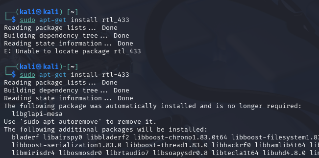

install seemed to be successful, lets try

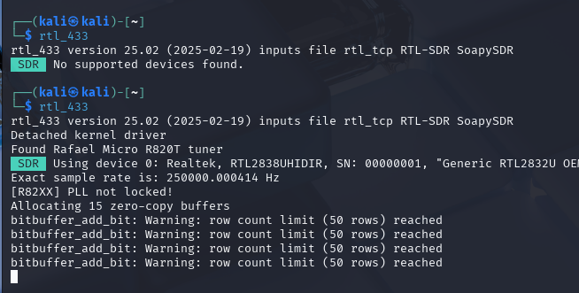

first just running rtl_433 i get SDR no supported devices found

then enabling the "RTL-SDR v3"(connected to host), to my VM and it works!

---

## 🧠 C) Analyze with rtl_433

> Analyze the provided sample using `rtl_433`:  
> `Converted_433.92M_2000k.cs8`  
> What happens in the sample? What identifiers can you find (IDs, etc)?

Filename suggests the frequency was 433,92MHz and 2000k sample rate converted to cs8

to analyze the recording we use the command

`rtl_433 Converted_433.92M_2000k.cs8`

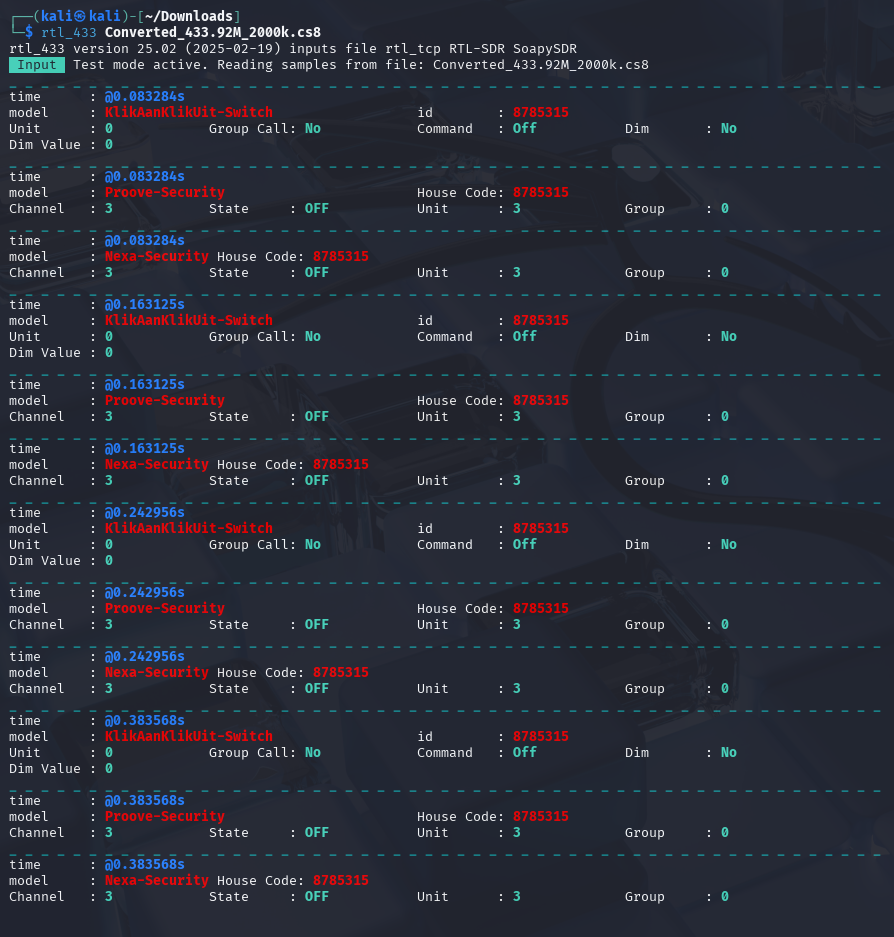

alternatively we can print the data in other formats too, json:

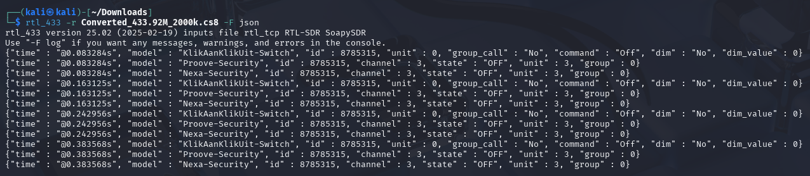

We make the following findings:

All events shared the same ID:**8785315**

It captured following protocols/devices:
**KlikAanKlikUit-Switch
Proove-Security
Nexa-Security**

Seems to be smart home related remote to control lighting etc.

Time of recording events were from **0,08s to 0,38s**

KlikAanKlikUit-Switch events all sent the:
Unit: **0**
State/Command: **Off** 
Dim: **No**
Dim value: **0**
Group call: **No**

Nexa-Security and Proove-Security had the 
Channel: **3**
Unit: **3**
Group: **0**
State/Command: **Off**

---

## 🔁 D) Convert and analyze complex16s format

> Convert the `.complex16s` sample to a format compatible with `rtl_433` and analyze it.  
> Sample file:  
> `Recorded-HackRF-20250411_183354-433_92MHz-2MSps-2MHz.complex16s`

For this task it seems to only require correct name change with required naming.

`cp Recorded-HackRF-20250411_183354-433_92MHz-2MSps-2MHz.complex16s converted_433.92M_2000k.cs8`

name has to have the frequency and sample rate 433.92Mhz and 2000k.

analyzing the file with rtl_433:

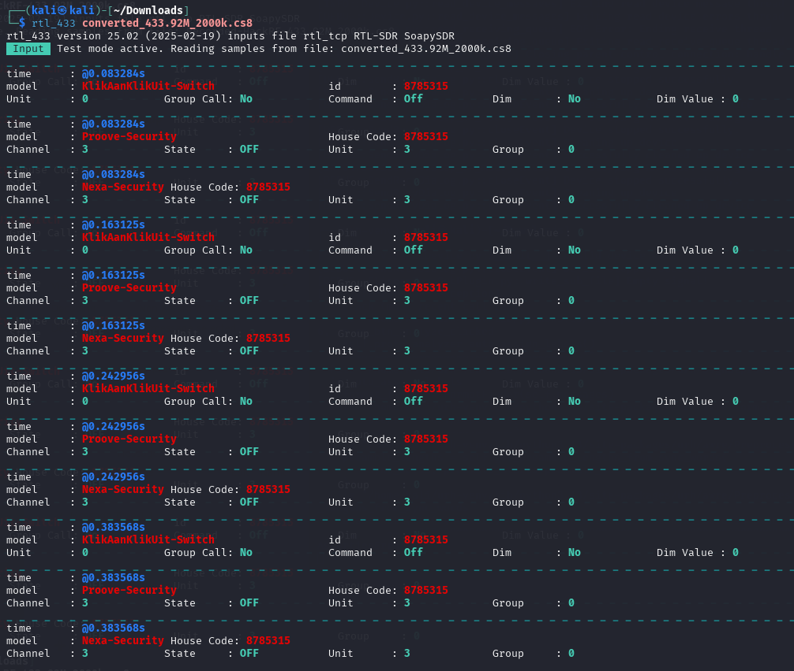

its the same recording we analyzed in previous task!

---

## 🔧 E) Install URH - Ultimate Radio Hacker

> Install and use URH to examine this signal:  
> `1-on-on-on-HackRF-20250412_113805-433_912MHz-2MSps-2MHz.complex16s`  
> The sample contains three presses of the "ON" button on a Nexa remote socket.

Encountered different errors while trying to install with pipx, so installed in virtual env with following commands:

`python3 -m venv ~/urh-venv`

`source ~/urh-venv/bin/activate`

`pip install --upgrade pip setuptools wheel`

`pip install urh`

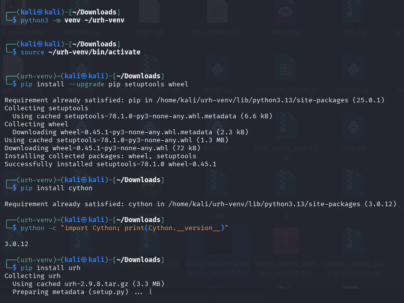

installation complete, and urh is working:

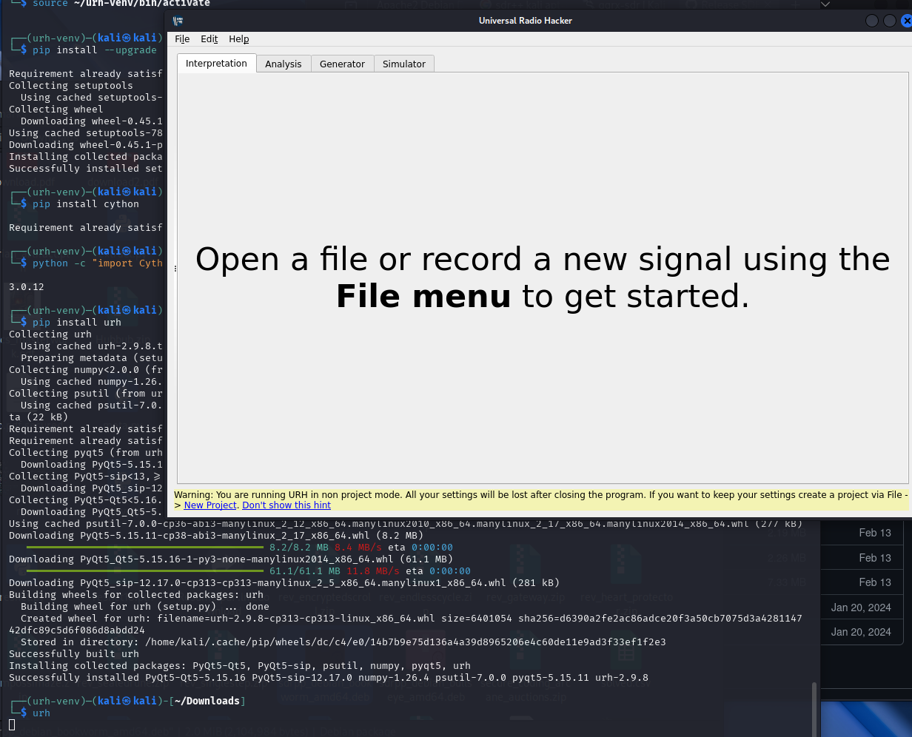

---

## Analyze 1-on-on-on-HackRF-20250412_113805-433_912MHz-2MSps-2MHz.complex16s

### 🔍 F) Sample overview

> Describe the above sample file in general terms:  
> - Duration  
> - Frequency  
> - When it was recorded  
> - What it looks like visually

filaname has some details and rest revealed in urh:

Duration: 2,75s
Frequency: 433,912MHz
Time: 2025-04-12 11:38:05

opening the file in urh:

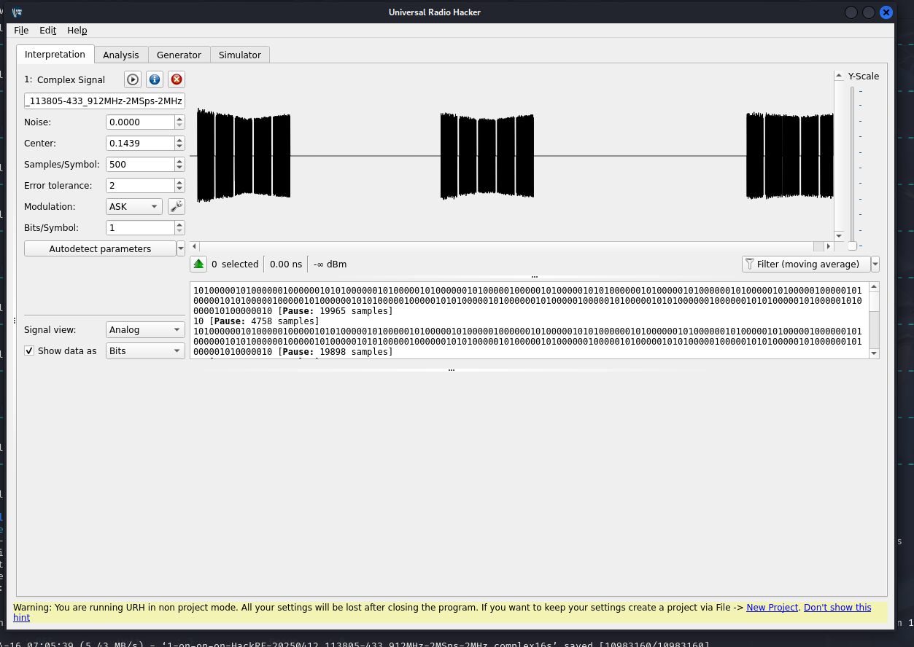

setting sample rate to 2MSps from the info button next to file name

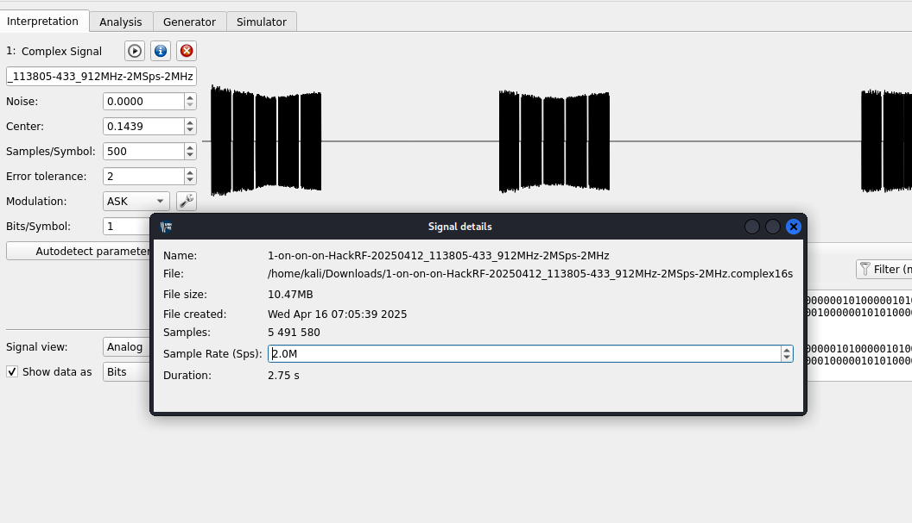

When selecting all data, length seems to be 2,75s

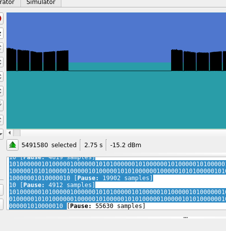

At a fast glance, it looks like there are 3 "blobs" of signals, as hinted in the filename 1-on-on-on and mentioned in task description. We can determine/guess that these are the on button signals:

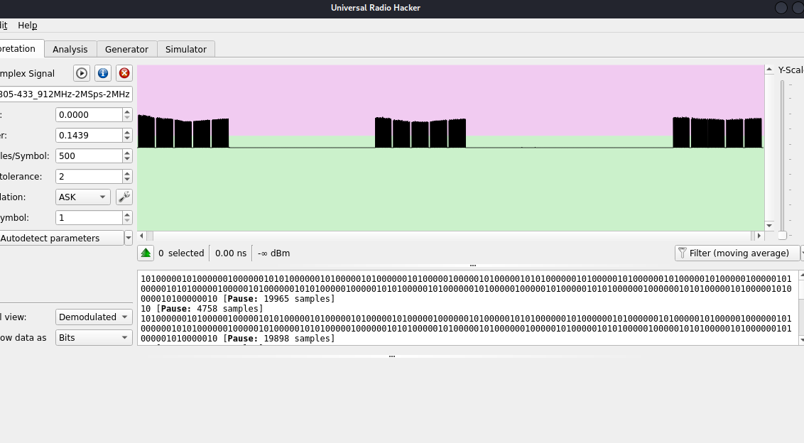

---

### 🧮 G) Demodulate signal into raw bits

> Demodulate the signal and extract raw bits.  
> - What is the modulation type?  
> - How long is one raw bit in time?  
> - Describe the time duration in relatable terms.

URH autodetects the modulation to be ASK (Amplitude shift keying)

Selecting show data as bits, then selecting/highlighting a single bit:

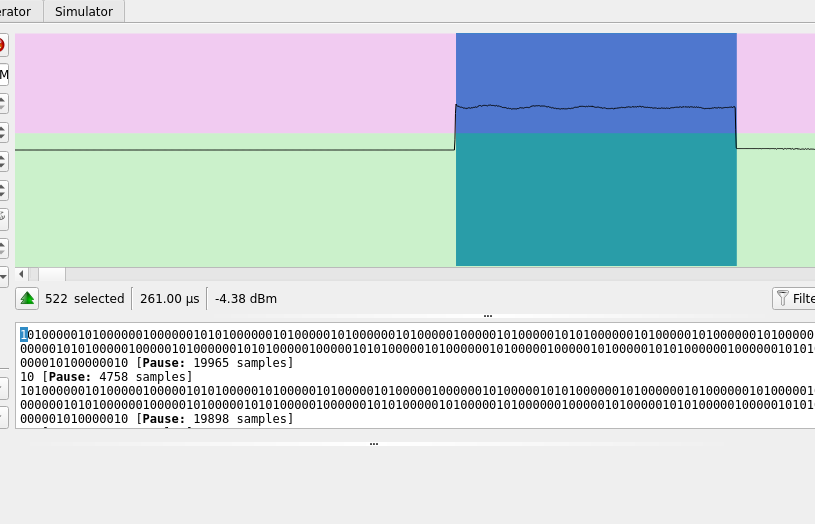

This shows single bit length as 261µs (microseconds)
however some bits show only as 160µs, so im not sure whats accurate.
To compare it into something in real life, if a blink of an eye is 100ms, it fits around 450-500 bits

---

## 🧪 H) Try SDR++ *(optional)*

> Try using the `sdr++` software and demonstrate a "hello world" type example.

Installed on windows 11, listening to different bands but had a pretty bad dipole antenna so even FM radio channels were distorted. Swapped to a mcgill 7.5db LoRa antenna and now FM radio channels are clear.

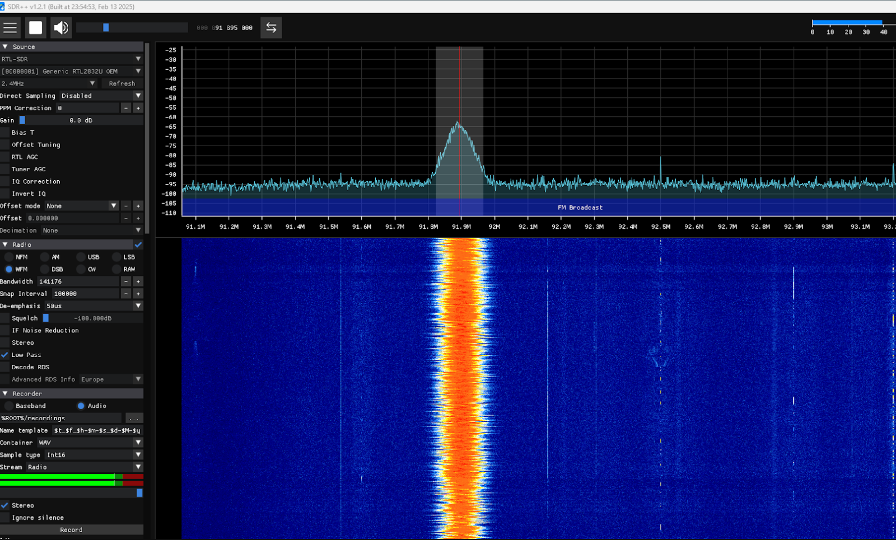

---

## 🔬 I) Try GNU Radio *(optional, more advanced)*

> Install GNU Radio and build a simple "hello world" style project.

to install i used:

`sudo apt-get install gnuradio`

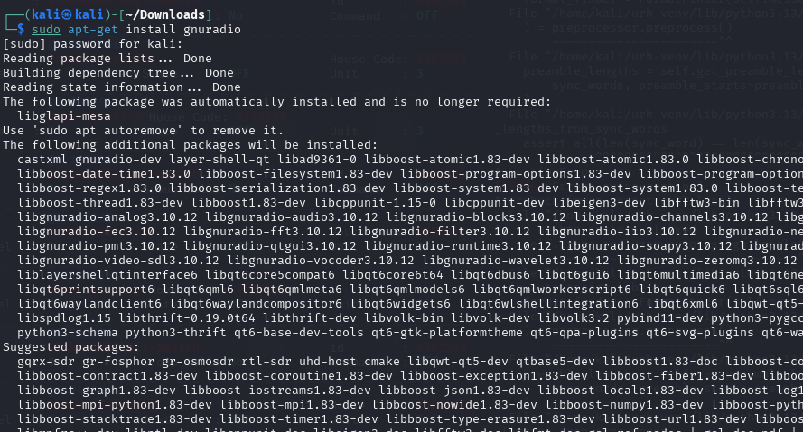

Seems to require lots of additional packages.

Running gnuradio:

`gnuradio-companion`

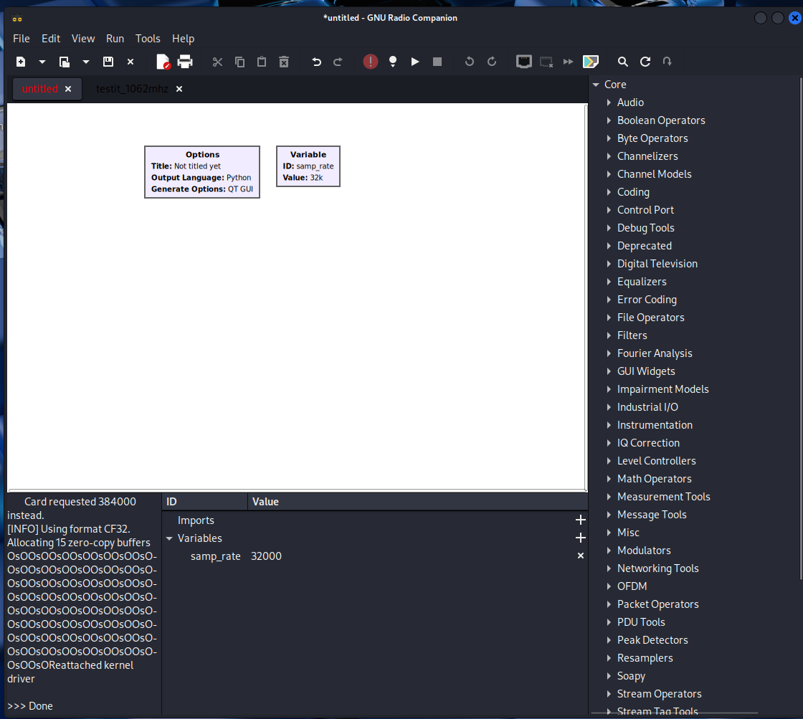

found i guide how to load up FM radio:
https://wiki.gnuradio.org/index.php?title=RTL-SDR_FM_Receiver

To add blocks i used the search on the right side, starting with searching RTL to add the **Soapy RTLSDR source**, then adding **QT GUI Time and Frequency sinks**. These will add the graphs you see in the screenshot, but no audio.

To add audio, we add 3 blocks:
**Rational resampler
WBFM Receive
Audio sink**

To enable frequency adjustment while live, we add **QT GUI Range block**

Values added are also shown on the screenshot

Finally pressing play to listen and activate.

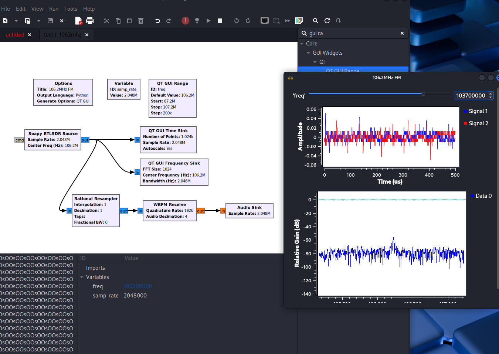

At first it seemed abit intimidating, but once everything is setup it actually makes perfect sense.

---

## 🛠️ Tools and Hardware Used

- **Software Defined Radio Tools:** rtl_433, URH (Universal Radio Hacker), WebSDR  
- **Optional:** SDR++, GNU Radio  
- **Operating System:** Kali Linux / Win 11
- **SDR Hardware:** RTL-SDR dongle, McGill LoRa antenna
- **Virtualization:** VirtualBox  
- **Workstation:** AMD Ryzen 9 5900X, RTX 3080, 32 GB RAM  

---

## 📚 Resources

- https://terokarvinen.com/verkkoon-tunkeutuminen-ja-tiedustelu/ *(Karvinen 2025)*  
- https://www.youtube.com/watch?v=lFLt3NQXVbM *(Hubacek 2019: Universal Radio Hacker Tutorial)*  

- https://github.com/merbanan/rtl_433 *(rtl_433 GitHub repo)*  

- https://www.rtl-sdr.com/tag/rtl_433/ *(RTL-SDR Tutorials and Blog)*  
 
- https://www.websdr.org/ *(WebSDR receiver list)*  
- https://wiki.gnuradio.org/index.php/InstallingGR

- https://wiki.gnuradio.org/index.php?title=RTL-SDR_FM_Receiver *(Gnuradio FM tutorial)*
---
