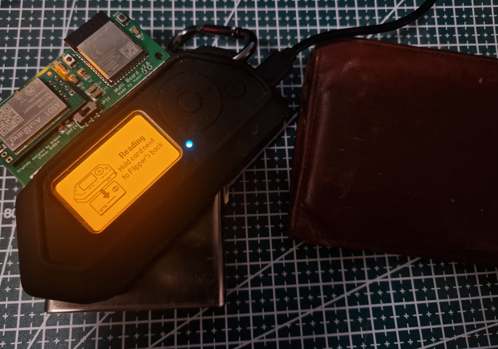

# 📶 H4 – NFC & RFID

This is Homework 4 from the course *Network Attacks and Reconnaissance*  
🔗 https://terokarvinen.com/verkkoon-tunkeutuminen-ja-tiedustelu/

In this task, we focus on exploring RFID and NFC technologies through real-world tools and cases. A compatible Android phone is needed for hands-on testing (iPhones may have limited support). Optional hardware such as Proxmark3 or Flipper Zero can enhance testing, but are not mandatory.

---

## 📑 Contents
- [🔍 1) Review your own RFID exposure](#1)
- [🧠 2) Learn APDU command structure](#2)
- [📰 3) Research an RFID hacking case](#3)
- [🛠️ Tools and Hardware Used](#tools)
- [📚 Resources](#resources)

---

## 🔍 1) Review your own RFID exposure

> Examine RFID products around you.  
> How well are you protected from RFID skimming?

>Reflect on whether your ID cards, access badges, or payment cards could be read without your consent. What would an attacker learn?

For this task im doing a practical test on my wallet and cards.

I have a metallic card holder and a regular wallet both filled with smart cards(id cards, gym cards, visa cards etc.). I will conduct tests reading cards from the outside of the holder and wallet, and then emulate the card.

The metal holder protects the cards from outside reading, tested with flipper zero. The card holder has several readable cards inside it, but its unable to detect any of them.

The regular wallet has several cards inside it, the flipper zero was able to read most of them, also the cards being "not on top". When slightly adjusting reading position it reads another card inside the wallet. In total I had 6 readable cards in the wallet, and found 4. Also did not flip the wallet over.

Most of the cards dont reveal critical data, but can be easily cloned and emulated by the flipper zero. My visa card number and expiry date is revealed, and the card can be saved on the flipper.

After a card is read it can be saved and emulated on the flipper zero. The reader sees the card as it would be the original:

The card has to be scanned from the backside of the flipper zero.

Tests were done using flipper zero & latest momentum firmware. Using the NFC app.

As a conclusion, a protected wallet or a protected card holder should always be used to protect against.

---

## 🧠 2) Learn APDU command structure

> Study the structure of APDU (Application Protocol Data Unit) commands.  
> You may use AI tools or documentation to assist you.

>Understand how communication happens between an RFID card and reader at a low level. What are the basic fields in an APDU message?

- **APDU** stands for application protocol data unit. 
- In smart cards, its the communication command protocol between smart card reader/writer and the card.

### APDU fields:

*source: wikipedia https://en.wikipedia.org/wiki/Smart_card_application_protocol_data_unit*

**Example apdu command:**
`00 A4 04 00 07 A0 00 00 03 06 03 00`

`00` → CLA - Standard command

`A4` → INS - SELECT instruction

`04 00` → P1 & P2 - Select by name (AID)

`07` → Lc - Data (AID) is 7 bytes long

`A0 00 00 03 06 03 00` → Data - App Identifier (AID)

**Example APDU response from card:**
`90 00`

**APDU command** is like an instruction that tells the card what it wants

and the response is called **APDU response**

Might add APDU test later when i get my hands on pc compatible reader.

---

## 📰 3) Research an RFID hacking case

> Find and summarize an interesting news article about an RFID-related hack.  
> Hint: Many involve identity cards or passports.

>Look for real-world examples of RFID exploitation — e.g., bypassing security gates, cloning identity documents, or academic research.

## Saflok hotel key vulneraibility impacting 3 million locks

Saflok hotel key card vulnerability impacted over 3 million locks. It was initially reported to the manufacturer Dormbaka in 2022 and disclosed in March 2024 by Lennert Wouters, Ian Carroll, rqu, BusesCanFly, Sam Curry, sshell, and Will Caruana.

*source: defcon 32 slides https://unsaflok.com/videos/slides.pdf*

The hack requires the attacker to only read one keycard from the property to attack any door. You could read your own room key and enter any room afterwards. The attack can be done with flipper zero.

**The security researchers proof of concept:**

*source: defcon 32 slides https://unsaflok.com/videos/slides.pdf*

**Fixes Needed:** Firmware updates, reprogramming of locks, and issuing new keycards.

**sources:**
https://www.wired.com/story/saflok-hotel-lock-unsaflok-hack-technique/
https://unsaflok.com/
https://www.cve.org/CVERecord?id=CVE-2024-29916
https://www.armis.com/blog/the-saflok-vulnerability-a-wake-up-call-for-the-hospitality-industry/

---

## 🛠️ Tools and Hardware Used

- **Phones:** Android (with NFC support)  
- **Apps:** NFC Writer, MIFARE Classic Tool
- **Hardware (Optional):** Flipper Zero, USB smart card reader
- **Operating Systems:** Flipper momentum firmware / Android  

---

## 📚 Resources
- https://www.cve.org/CVERecord?id=CVE-2024-29916
- https://www.armis.com/blog/the-saflok-vulnerability-a-wake-up-call-for-the-hospitality-industry/
- https://unsaflok.com/
- https://terokarvinen.com/verkkoon-tunkeutuminen-ja-tiedustelu/ *(Karvinen 2025)*  
- https://flipperzero.one/  

---