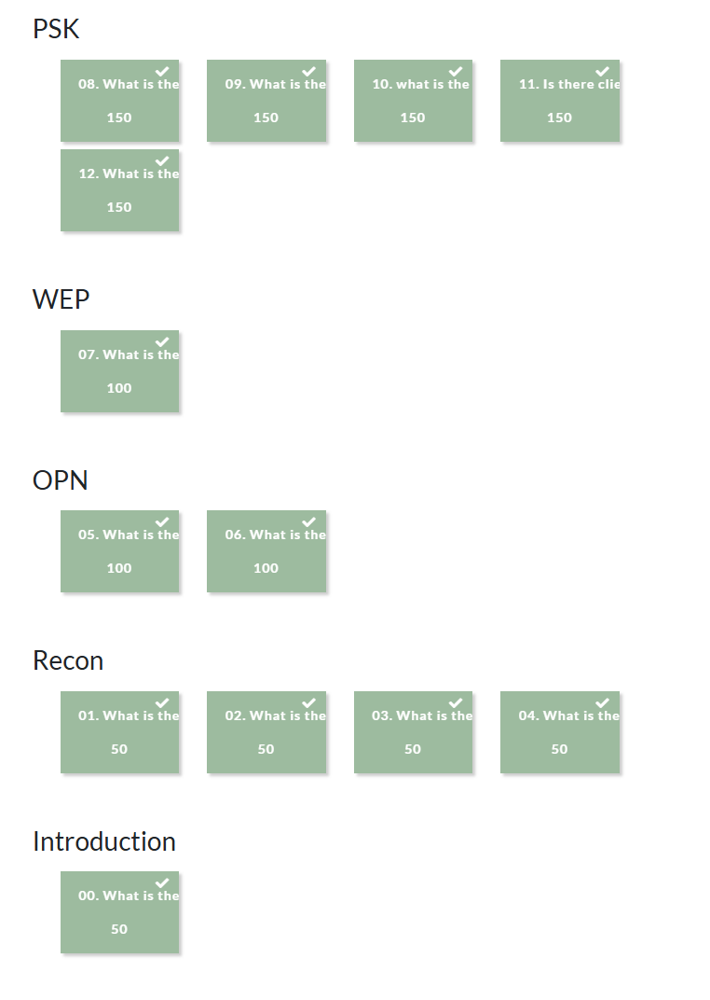
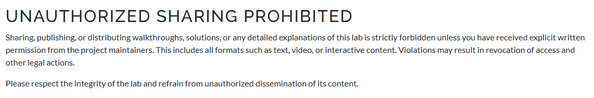

# 📶 H6 – WiFi Challenge Lab

This is Homework 6 from the course *Network Attacks and Reconnaissance*  
🔗 https://terokarvinen.com/verkkoon-tunkeutuminen-ja-tiedustelu/

In this assignment, you will explore WiFi security through a hands-on challenge environment and reflect on your experience and its implications on wireless network safety.

---

## 📑 Contents
- [📡 A) Explore WiFi Challenge Lab 2.1](#a)
- [📝 B) Reflection on What You Learned](#b)
- [🔐 C) Changed Views on WiFi Security](#c)
- [🛠️ Tools and Hardware Used](#tools)
- [📚 Resources](#resources)

---

## 📡 A) Explore WiFi Challenge Lab 2.1

> Familiarize yourself with the *WiFi Challenge Lab 2.1* exercise environment.  
> Use existing instructions and material as needed.

At the time of writing, I’m stuck on Challenge 13 involving `wpa_supplicant` and Wacker. However, I’ve completed Challenges 1–12 and I must say I’m genuinely impressed by the lab’s level of realism. The “virtualization” is surprisingly close to real-world scenarios.

So far, I’ve completed tasks involving reconnaissance, handshake capture and cracking, deauthentication attacks, and sniffing unencrypted traffic to extract router credentials. Most tasks were solved with some Googling or checking hints. If I was stuck for longer periods, I asked ChatGPT. For a few tough ones, I used walkthroughs to move forward.

Overall, I’m really enjoying the challenge environment and plan to continue progressing through the remaining tasks.

~~Writeups about the challenges  [Here](WifiChallenge.md)~~

**Did some writeups for the challenges but its not allowed to make them public**

---

## 📝 B) Reflection on What You Learned

> Write a report on what you learned during the exercise.  
> What surprised you?

In the challenges, I used a variety of tools and techniques, including:

- Packet capture tools for handshake collection

- Deauthentication methods to force re-authentication

- Cracking tools for WPA/WPA2 hashes

- Network sniffing for plaintext traffic

- aircrack-ng, wpa_supplicant, and other CLI-based utilities

- Basic Bash scripting and Linux networking knowledge

- Remote hashcat setup

A more detailed list of techniques and tools are listed at the end of this report [Here](#tools)

During the tasks i had issues with hashcat, so also created a remote cracking setup with scp over ssh.

---

## 🔐 C) Changed Views on WiFi Security

> How did your perception of WLAN security change after completing the lab?

While I already had a general understanding of WiFi vulnerabilities, this lab definitely broadened my awareness, especially regarding newer techniques and lesser known weak spots. I wasn’t particularly surprised, though, since I know that both new tools and vulnerabilities appear constantly. That said, the hands-on exposure to these threats made the risks feel much more realistic.

---

## 🛠️ Tools and Hardware Used

## Image

- **WiFi Challenge Lab:** v2.1  

## 📶 Wi-Fi Hacking Tools used

### 🔧 Wireless Hacking Tools

**airmon-ng** – enable monitor mode
**airodump-ng** – Wi-Fi recon & client monitoring
**aireplay-ng** – deauth/fake auth attacks
**aircrack-ng** – handshake cracking (WPA/WEP)
**airbase-ng** – rogue AP (evil twin) also used to capture handshakes

### 🛰 Modern Hash/Handshacke cracking Wi-Fi Tools (WPA2/WPA3)

**hcxdumptool** – handshake/PMKID capture
**hcxpcapngtool** – convert .pcapng to .22000
**hcxhash2cap** – convert hash formats
**hashcat** – GPU/CPU-based hash cracking
**john** – alternative password cracker

### 🧪 WPA3-SAE Attack Tools

**wacker.py** – Dragonblood-based WPA3 exploit tool
**wpa_supplicant** (patched) – used by wacker

### 📡 Other Useful Tools

**hostapd-mana** – rogue AP to bait handshakes
**eaphammer** – advanced evil twin + credential harvest
**wireshark** – packet inspection & protocol analysis
**tcpdump** – lightweight packet capture

## 🎯 **Wi-Fi Hacking Techniques**

### 🔍 Reconnaissance

**Passive sniffing** – capturing beacons, probe requests, and client/AP metadata with **airodump-ng**, **hcxdumptool**
**ESSID discovery** – identifying hidden networks via client probes
**Client tracking** – mapping stations to APs, watching roaming behavior

### 🧲 Attack Techniques

**Handshake capture** – grabbing WPA2 4-way or WPA3 SAE handshakes
**PMKID attack** – capturing and cracking the PMKID without full handshake
**Deauthentication attack** – forcibly disconnecting clients to trigger handshake (via aireplay-ng)
**Fake authentication** – pretending to be a client to associate with WEP/WPA2 APs

### 💣 Access Point Spoofing / Evil Twin

**Rogue AP creation** – using hostapd-mana, airbase-ng, or eaphammer
**Downgrade attack** – tricking WPA3 clients into connecting using WPA2 (SAE→PSK)
**SSID impersonation** – baiting clients with common/known SSIDs

### 🔐 Cracking / Brute-force

**Offline WPA2 password cracking** – with hashcat or john
**WEP key cracking**– collecting IVs and running aircrack-ng
**Dictionary attacks** – using rockyou.txt and similar lists

### 🔍 Traffic Analysis

**Cookie/session hijacking** – sniffing decrypted HTTP cookies to access routers
**Wireshark inspection** – looking for POST requests, cleartext leaks, or credentials

---

## 📚 Resources

- https://terokarvinen.com/verkkoon-tunkeutuminen-ja-tiedustelu/ *(Karvinen 2025)*  
- https://lab.wifichallenge.com/ WiFiChallenge Lab v2.1

- Luento materiaali (WIFI) – Lari *(provided in class+Moodle)*  

- https://github.com/blunderbuss-wctf/wacker

---